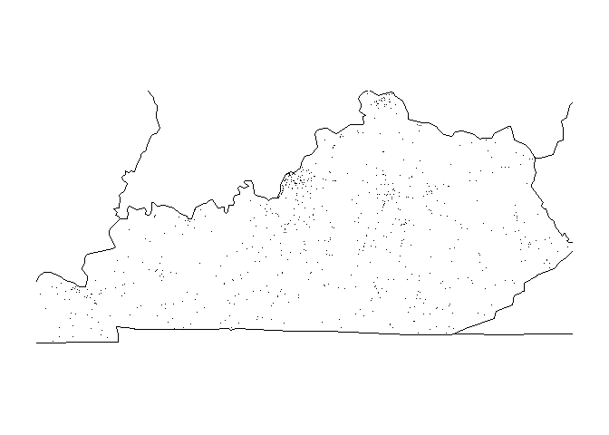

<!-- README.md is generated from README.Rmd. Please edit that file -->

# README

<!-- badges: start -->

[](https://travis-ci.com/rsizem2/example-rpackage-fars)
<!-- badges: end -->

The `fars` package provides several functions for analyzing vehicle
crash data. The original code was provided as part of the *Building R
Packages* course on Coursera. This original code has been edited to
avoid using some deprecated functions, catch some extra possible errors
and provide more cross-platform functionality.

## The FARS datasets

The FARS data comes from the US National Highway Traffic Safety
Administration’s [Fatality Analysis Reporting
System](https://www.nhtsa.gov/research-data/fatality-analysis-reporting-system-fars),
which is a nationwide census providing the American public yearly data
regarding fatal injuries suffered in motor vehicle traffic crashes. The
data for the years 2013, 2014 and 2015 are included with this package in
the `extdata` directory.

## Installation

You can install this package directly from GitHub using the `devtools`
package:

``` r
library(devtools)
install_github("rsizem2/example-rpackage-fars")
```

## Example

We can visualize the accident data for a given state if we know the
state number. For example, the state code for Kentucky is 21, so we can
generate the accidents in the year 2015 as follows:

``` r
fars_map_state(state.num = 21, year = '2015')
```



The state code for Alabama is 1, so the accidents in 2013 can be
generated with the following code:

``` r
fars_map_state(1,'2013')
```


